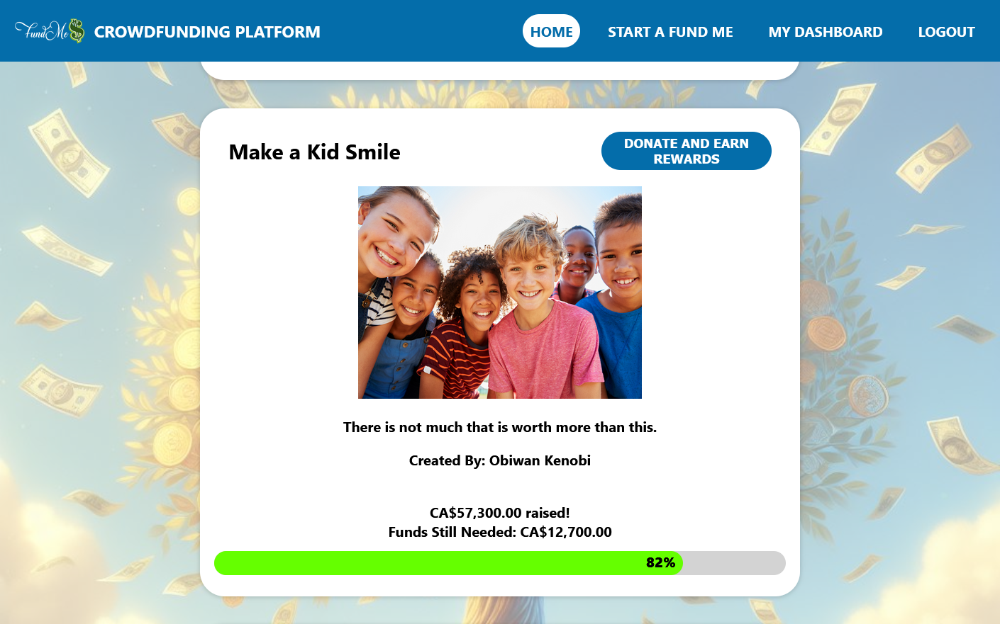

# Fund Me! - A Crowdfunding App

A simple crowdfunding Full stack web application similar to the likes of GoFundMe and Kickstarter made using NodeJS, Express, React, and PostgreSQL.  
It utilized RESTFul APIs for communication between Express.js backend and React.js frontend. Stripe API integration is used as payment system to capture donations. 

Users can register, login, donate to any project with a credit card, create their own funding projects, edit their projects, view their projects donation's status and  and donation reciepts on their dashboard.
It also provides opportunity to earn rewards/incentives if a user donates for a project. 





## Initial Setup

From inside crowdfunding-app/backend/, run ```npm i``` to download dependencies. 
Then move into crowdfunding-app/frontend/ and run ```npm i -f``` to force the download of the remaining dependencies. 

Ensure that PostgeSQL is running, and create a database named ```crowdfundingdb```. 

Next, use the schema and seed files within crowdfunding-app/backend/db/ to populate the database.

E.g. ```\i db/01_schema.sql```, ```\i db/seeds/01_users.sql```

## Running the App

Once the database is ready, run the backend app from within crowdfunding-app/backend/ with ```npm start``` 
and do the same for the frontend in crowdfunding-app/frontend/.

Finally, in a web browser, navigate to ```localhost:3000/``` to view the site.
